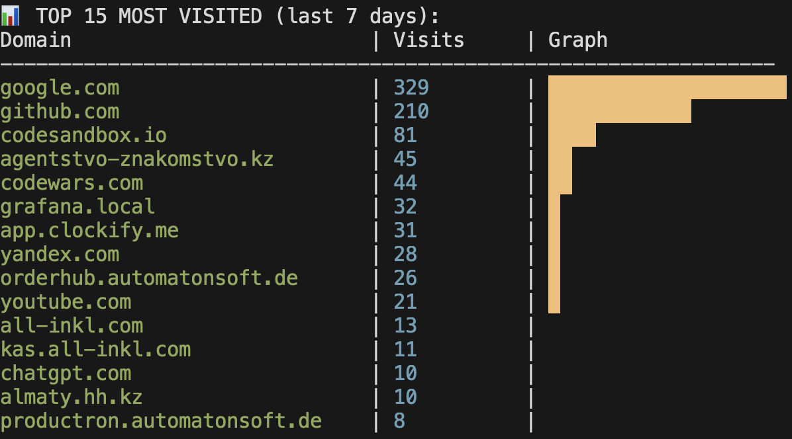

# 🌍 Safari URL Tracker

Быстрая консольная утилита на **Rust**, которая анализирует историю посещений Safari, строит отчет в терминале и генерирует интерактивные HTML-дашборды с графиками.

 <!-- Сюда скриншот терминала -->

## ✨ Особенности

- **Высокая производительность**: Написано на Rust, работает с SQLite напрямую.
- **Безопасность**: Работает с временной копией базы данных, не блокируя и не повреждая оригинал Safari.
- **Интерактивные фильтры**: Поиск по доменам и ограничение количества результатов через аргументы CLI.
- **Визуализация**: 
  - Текстовые графики прямо в терминале (ANSI colors).
  - Генерация полноценного HTML-отчета с использованием **Chart.js**.
- **Автоматизация**: Автоматически открывает отчет в браузере после генерации.

## 🛠 Требования

- **macOS** (так как анализируется база Safari).
- **Rust** (cargo).
- **Full Disk Access**: Терминалу требуется разрешение на чтение папки `~/Library/Safari`.

## 🚀 Быстрый старт

1. **Дайте доступ к диску**:
   Системные настройки -> Конфиденциальность и безопасность -> Полный доступ к диску -> Добавьте ваш Терминал (iTerm, Alacritty или стандартный).

2. **Склонируйте репозиторий**:
   ```bash
   git clone https://github.com
   cd url-tracker
   # Показать ТОП-15 за неделю
   cargo run

   # Показать ТОП-10 и отфильтровать только .kz домены
   cargo run -- 10 .kz
